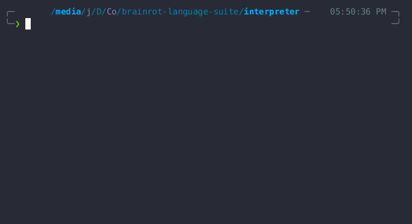

# BrainrotLang 🧠💀

A chaotic, meme-inspired programming language interpreter that turns Gen Z slang into executable code. Because why write `function` when you can write `vibe`?



## 🔥 Features

- **Full interpreter implementation** with lexer, parser, and evaluator
- **Brainrot syntax** that actually compiles and runs
- **Dynamic typing** with support for integers, booleans, strings, arrays, and hash tables
- **First-class functions** because vibes are important
- **Control flow** with `fr`/`sus` (if/else) statements
- **Built-in data structures** including arrays and hash maps

## 🎯 Syntax Overview

### Keywords

```javascript
vibe; // function declaration
yeet; // variable declaration
based; // true
cap; // false
fr; // if
sus; // else
slay; // return
```

### Examples

**Variables:**

```javascript
yeet x = 5;
yeet name = "BrainrotLang";
yeet isValid = based;
```

**Functions:**

```javascript
vibe add(a, b) {
    slay a + b;
}

yeet result = add(10, 20);
```

**Conditionals:**

```javascript
yeet score = 95;
fr (score > 90) {
    slay "based";
} sus {
    slay "cap";
}
```

**Arrays:**

```javascript
yeet nums = [1, 2, 3, 4, 5];
slay nums[2]; // returns 3
```

**Hash Tables:**

```javascript
yeet person = {
    "name": "Brainrot",
    "rizzLevel": 100,
    "sigma": based
};

slay person["rizzLevel"]; // returns 100
```

## 🚀 Getting Started

### Prerequisites

- Go 1.19 or higher

### Installation

1. Clone the repository:

```bash
git clone https://github.com/Jitesh117/brainrotLang-interpreter.git
cd brainrot-lsp
```

2. Build the interpreter:

```bash
go build -o brainrot ./cmd/main.go
```

3. Run the REPL:

```bash
./brainrot
```

## 🏗️ Architecture

The interpreter follows a classic three-stage architecture:

### 1. Lexer/Tokenizer

- Converts source code into tokens
- Handles keywords, operators, literals, and identifiers
- Supports single and multi-character operators (`=`, `==`, `!=`, etc.)

### 2. Parser

- Builds an Abstract Syntax Tree (AST) from tokens
- Implements Pratt parsing for expressions
- Handles operator precedence and associativity

### 3. Evaluator

- Tree-walking interpreter that executes the AST
- Environment-based variable and function scoping
- Built-in support for arithmetic, comparison, and logical operations

## 📝 Language Specification

### Data Types

- **Integers**: `42`, `-17`
- **Booleans**: `based` (true), `cap` (false)
- **Strings**: `"hello world"`
- **Arrays**: `[1, 2, 3]`
- **Hash Tables**: `{"key": "value"}`
- **Functions**: `vibe(x) { slay x * 2; }`

### Operators

- **Arithmetic**: `+`, `-`, `*`, `/`
- **Comparison**: `==`, `!=`, `<`, `>`
- **Logical**: `!` (not)
- **Assignment**: `=`

### Built-in Functions

- Array indexing: `array[index]`
- Hash key access: `hash["key"]`

## 🧪 Examples

Check out the `examples/` directory for sample programs:

```javascript
// fibonacci.br
vibe fib(n) {
    fr (n < 2) {
        slay n;
    }
    slay fib(n - 1) + fib(n - 2);
}

yeet result = fib(10);
```

## 🤝 Contributing

Contributions are welcome! Whether you want to:

- Add new language features
- Improve error messages
- Write documentation
- Create example programs
- Fix bugs

Please feel free to open an issue or submit a pull request.

### Development Setup

1. Fork the repository
2. Create a feature branch: `git checkout -b feature/amazing-feature`
3. Make your changes
4. Add tests if applicable
5. Commit your changes: `git commit -m 'Add amazing feature'`
6. Push to the branch: `git push origin feature/amazing-feature`
7. Open a pull request

## 🗺️ Roadmap

- [ ] **Compiler**: Bytecode compilation for better performance
- [ ] **LSP Integration**: Full Language Server Protocol support
- [x] **Standard Library**: Built-in functions for common operations
- [x] **Array Methods**: `.push()`, `.pop()`, `.length`, etc.

## 🙏 Acknowledgments

- Thorsten Ball for the excellent "Writing an Interpreter in Go" book
- The Go community for amazing tools and libraries
- Gen Z for providing the endless source of brainrot vocabulary

## 📞 Support

If you have questions, suggestions, or just want to share your brainrot programs:

- Open an issue on GitHub
- Star the repository if you find it helpful
- Share it with fellow developers who appreciate chaotic energy

---

**Stay unbothered, moisturized, happy in your lane, focused and keep flourishing!** ✨

_Built with Go and excessive amounts of brainrot energy_ 🧠⚡
